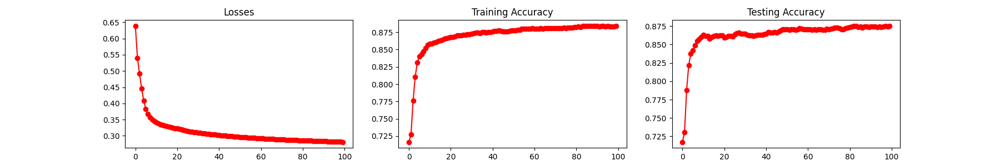

# Split Neural Network Demo

This repository gives a brief demonstration on how split learning
works in vertical federated learning (VFL). Specifically, we use the 
bank marketing data as a running example, 
i.e., [bank-additional-full.csv](https://archive.ics.uci.edu/ml/datasets/bank+marketing),
which consists of 20 features and a binary classification label.

The dataset is split into three parts. 
- first part as bank_additional_full_filtered_balanced_active.csv, which consists of
  the first 10 features and the labels
- second part as bank_additional_full_filtered_balanced_passive.csv, which consists of
  the last 10 features and the labels
- third party as bank_additional_full_filtered_balanced_server.csv, which consists of
  the labels. To use the pytorch data loader, duplicate the labels twice

## Environment Setup

Install the dependencies in `requirements.txt` with `Python3.7.x` environment
using the following command.

```
pip install -r requirements.txt --no-cache-dir
pip install jupyterlab
```

Alternatively, build the docker image to run inside the container.

```
docker build -t splitnndemo:v0.1 .
```

## Code Structure

The code structure is as follows.

```
+-- baseline (show the performance with full data and with only active party's data)
|   +-- bank-active-party.ipynb (notebook for training an NN model on active party's data)
|   +-- bank-full.ipynb (notebook for training an NN model on the full data)
|   +-- bank-preprocessing.ipynb (notebook for preprocess the dataset)
+-- dataset (the used experimental datasets)
|   +-- bank-additional-full.csv (the original dataset)
|   +-- bank_additional_full_filtered.csv (the preprocessed dataset)
|   +-- bank_additional_full_filtered_balanced.csv (the down-sampled dataset)
+-- splitnn
|   +-- bank_dataset.py (bank dataset reader)
|   +-- model.py (define the server and parties' model architecture)
|   +-- party.py (define party's splitnn training logic)
|   +-- server.py (define server's splitnn training logic)
|   +-- plot.py (plot the training result)
|   +-- util.py (data loader and socket communication help functions)
+-- Dockerfile
+-- README.md
+-- requirements.txt
```

## Run Experiments

#### Local Machine

For running on the local environment, start the `jupyter notebook` and run the
baselines, including train an NN model on the full dataset and train an
NN model on the active party's dataset. After that, run the following 
scripts in three terminals to train an NN model.

```
python3 server.py --data_file ../dataset/bank_additional_full_filtered_balanced_server.csv --epochs 100
python3 party.py --data_file ../dataset/bank_additional_full_filtered_balanced_active.csv --epochs 100
python3 party.py --data_file ../dataset/bank_additional_full_filtered_balanced_passive.csv --epochs 100
```

#### Docker Container

For running with docker container, you can use the following script
to utilize the notebook for baselines.

```
docker run -it -p 8888:8888 splitnndemo:v0.1
```

For the splitnn solution, you can run the following script to start a 
container with the detach mode.

```
docker run -itd -v $(pwd):/splitnndemo --entrypoint /bin/bash splitnndemo:v0.1
```

Then, run the containers in three terminals with the following
to train the splitnn model.

```
docker container exec -it <42174163fa3d> /bin/bash
python3 server.py --data_file /splitnndemo/dataset/bank_additional_full_filtered_balanced_server.csv --epochs 100
python3 party.py --data_file /splitnndemo/dataset/bank_additional_full_filtered_balanced_active.csv --epochs 100
python3 party.py --data_file /splitnndemo/dataset/bank_additional_full_filtered_balanced_passive.csv --epochs 100
```

## Results

For centralized training on the full data, the training loss, training accuracy, and
testing accuracy is shown as follows. 


For centralized training on the active party's data, the results are as follows.


For splitnn training on the active and passive party's data, the results
are as follows.

 


## Contact

To ask questions or report issues, please drop me an [email](dcswuyu@nus.edu.sg).
